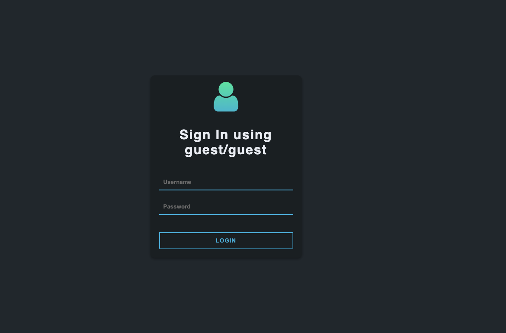
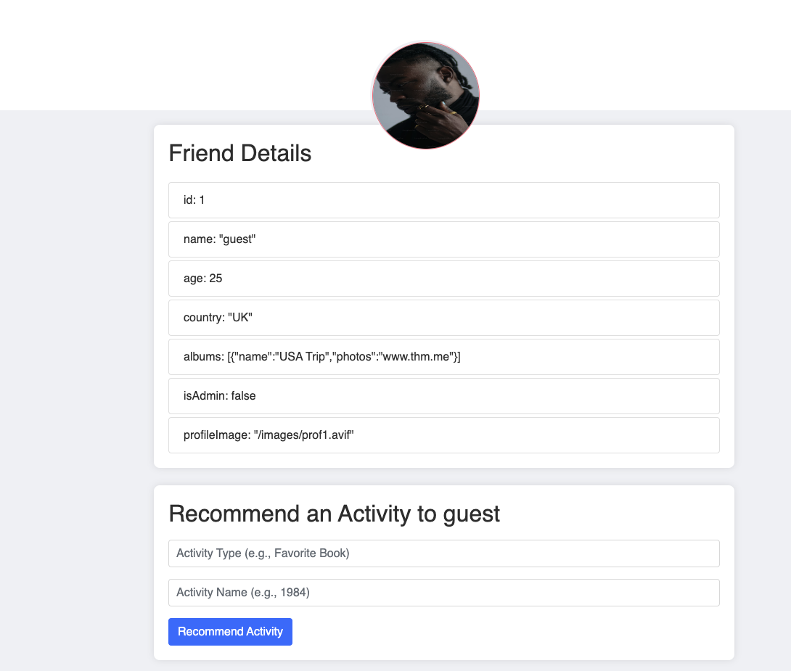
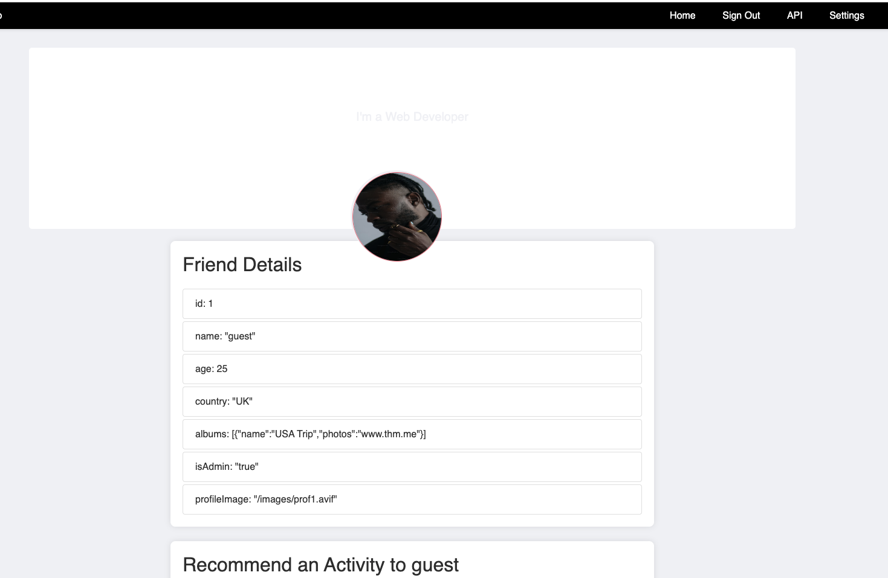
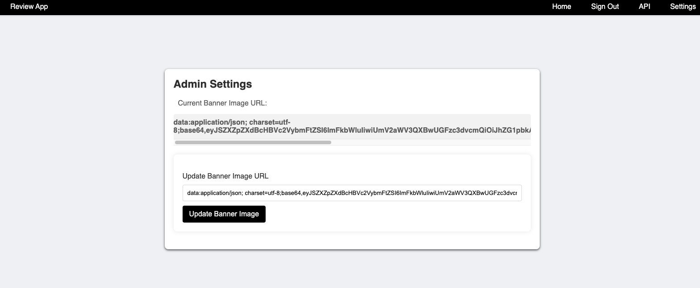
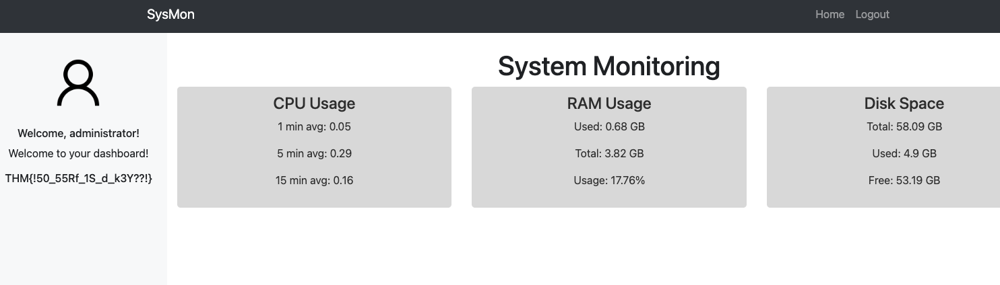
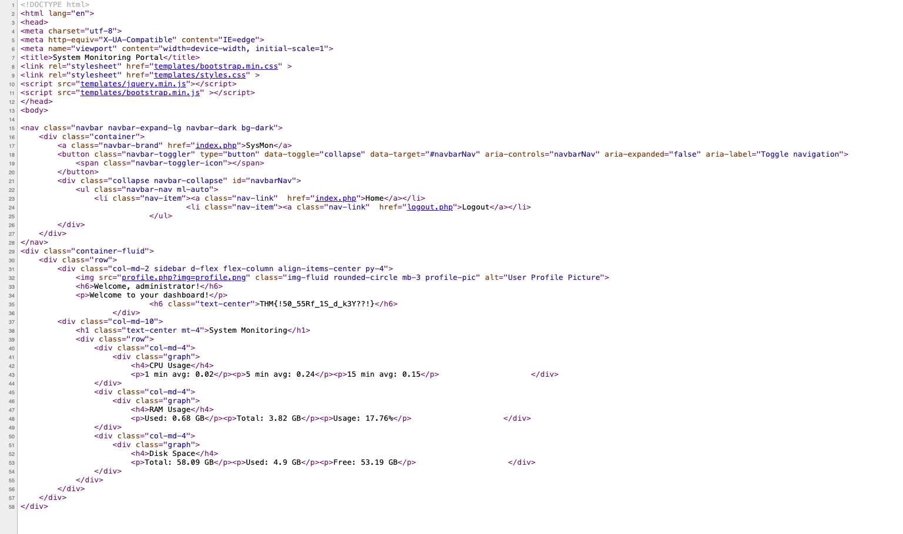

Room Link: https://tryhackme.com/room/include

# Reconnaissance
No doubt we always start with Reconnaissance. Let'start with
Port Scanning and see what's the open port on this target host.

Nmaps gives the following results with a quick scan.
```shell
Starting Nmap 7.95 ( https://nmap.org ) at 2025-10-19 15:04 CST
Nmap scan report for 10.201.13.4
Host is up (0.29s latency).
Not shown: 992 closed tcp ports (reset)
PORT      STATE SERVICE
22/tcp    open  ssh
25/tcp    open  smtp
110/tcp   open  pop3
143/tcp   open  imap
993/tcp   open  imaps
995/tcp   open  pop3s
4000/tcp  open  remoteanything
50000/tcp open  ibm-db2

Nmap done: 1 IP address (1 host up) scanned in 1.87 seconds
```

Things worth noting
1. They have Port 22 open, this may be a chance for brute force
on weak passwords.
2. They have the whole smtp, pop3, imap service. That means the
website supports mail service.
3. Remonteanything is a service for remote desktop. There are
some interesting CVEs about it.
4. ibm-db2 is a database service from IBM. Why is there a database
service directly open to port scanning? It may be supporting some
web service.


Next thing, let's send a simple get request to all this ports and
see if anyone of them providing a website UI.

I didn't do that at first, directly jumping to directory scanning,
which is a very bad idea, especially for ports taht are not usually
exposed, like port 4000 and port 50000. And if you do that, You will 
soon find that Port 4000 and Port 50000, each of them has a website 
UI. But I didn't go thru all of them at first. After I found
out Port 4000 has a frontend interface, I jumped right into that
rabbithole and completely forgot Port 50000.


Next step I did a little subdomain exploratory. I used
a very long subdomain list along with a self write single
thread script. The enumerating didn't finish before the machine auto 
shut down after 2 hours. I should have used a shorter payload list with
more frequently used subdomain as first recon tool. Also, I could have
used some existing tools with multi-thread - or develolp my own multi-thread
script.

The subdomain enumeratation with about 1/3 of the whole list gave me the
following avaialbe subdomains.
```shell
/images               (Status: 301) [Size: 179] [--> /images/]
/signup               (Status: 500) [Size: 1246]
/fonts                (Status: 301) [Size: 177] [--> /fonts/]
/signin               (Status: 200) [Size: 1295]
/index                (Status: 302) [Size: 29] [--> /signin]
```

Seems like nothing out of ordinary, hence I just started looking at the actual web pages and their source codes.

# Penetration
I spend a little time trying to guess what possible account and password
they will use for port 4000, but then I find the aha moment - it's directly
written in the login title. guest/guest. In fact, I even start to find CVEs
for the remoteanything service.


Once I entered the index page of this so-called Review app, I very soon
feel so familiar with the UI style - this is literally the same as the
previous rooms where prototype pollution is introduced.

You will certainly find proof in you own profile.


Then it becomes automatic - change the `isAdmin` value to true, so
that you will be able to see the extra tabs in your own profile page.



If you click into the tabs that newly showed up after you become admin,
you will find that the API ones is telling you that there is some internal
API you can use. The target host is 127.0.0.1 - that means the request has
to be initiated from the hosting machine itself.

And in setting tab, they provide an entry for you to set your own profile,
in URL format.

I mean that's a big enough hint. Just paste whatever API endpoint you get into that profile input and you will see the return, encoded in Base64.


Cyberchef come to rescue without doubt and you get the account and password
for the Sysmon app.

I presonally spend a lot of time trying to find how to access Sysmon App from
here because I completely forgot that there is another unusual port. Another
lesson that we should keep notes when doing CTF.

Jump to the part where I finally realizse (cheated by reading other writeups)
that I can go to port 50000 for Sysmon. Surely successfully login.

That's where I get the first flag, on the left of the screen.


I read the source code of the page a while longer and I found that the profile
picture link is definitely the weak link. I should be able to do a LFI attack 
becasue the way the link is organised in code.


However, lost patience to dig even deeper. I just continue reading the writeups 
and get how to crack the second question. 

The following part is completely inspired and learned from other writeups, though
I did verify them working.

1. Enumerate with different file path payloads. You'll find one with a lot of
dots.
2. You can visit etc/passwd and see the users in the server. You can then start
a ssh weak password attack - which is relatively easy.
3. Or you can do a email log poisoning, which is much harder since it involves 
the understanding of local file execution permissions and use telnet to organise
your mail content.

But this gives me the reminder that your payload dictionary is as important as
the tools you use for pentesting. I'll start spending more time organising my
own payloads.


